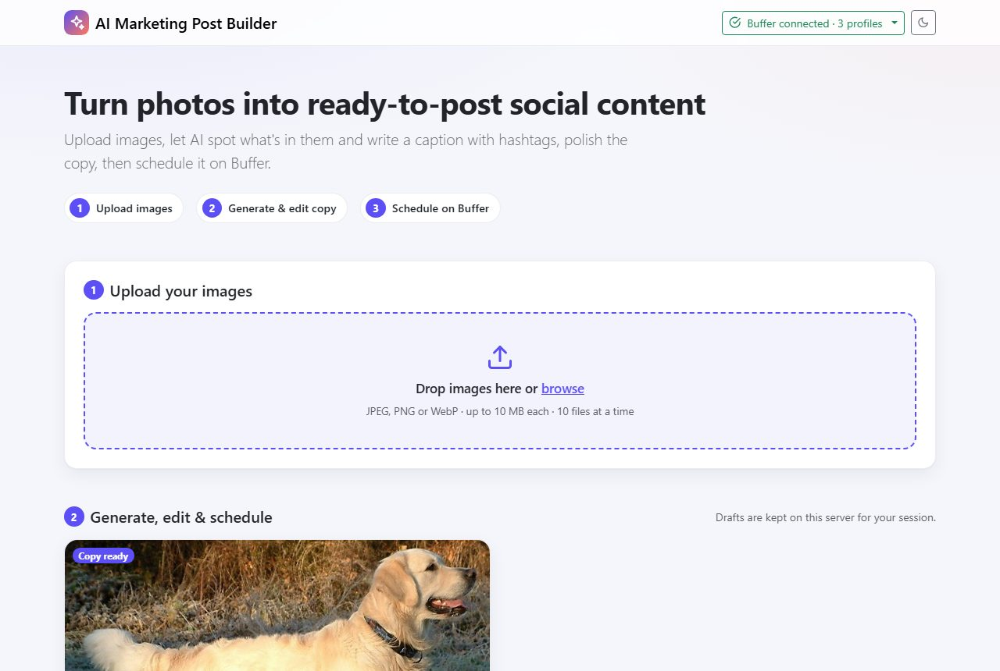
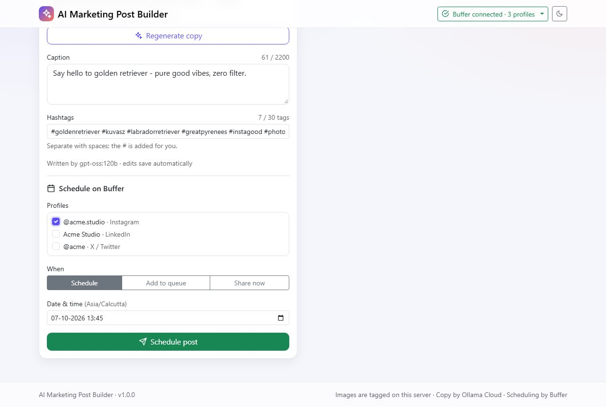
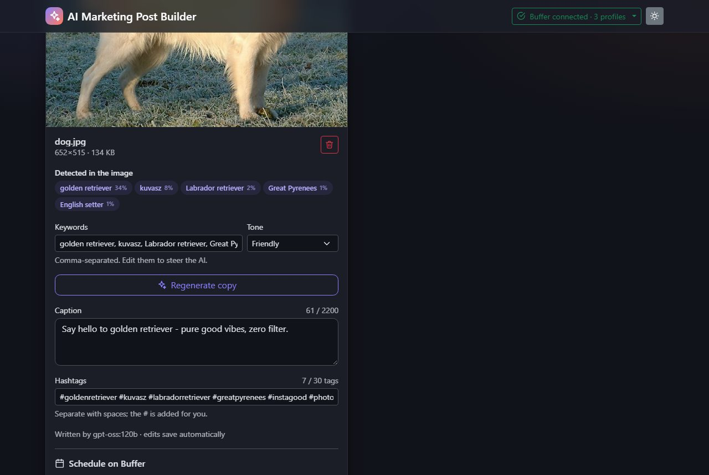
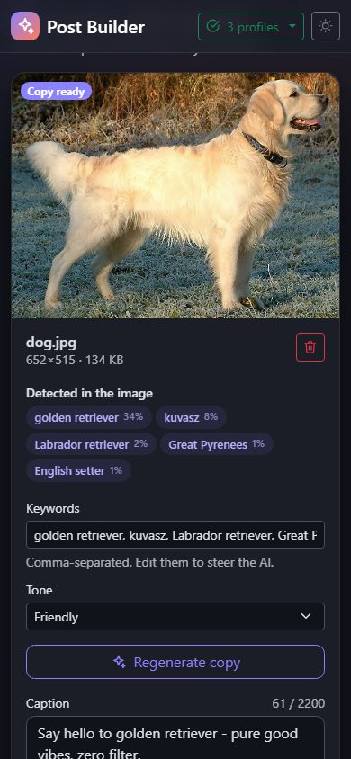
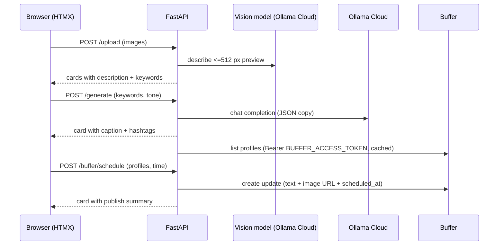

# Social Booster

Turn photos into ready-to-post social content in three steps:

1. **Upload** one or more images - an online vision model (free `gemma4:31b` on
   **Ollama Cloud**) describes each one and suggests keywords.
2. **Generate** a punchy caption and 5-8 hashtags with **Ollama Cloud**, then
   edit them freely (changes autosave).
3. **Schedule** the post with its image on one or more **Buffer** profiles -
   at a specific time, in the queue, or right now.

One FastAPI service renders Jinja2 pages; **HTMX** swaps small HTML fragments
for every interaction, styled with **Bootstrap 5**. No front-end build step.



| Copy editor and scheduling | Dark mode | Mobile |
|---|---|---|
|  |  |  |

## Highlights

* **Server-side AI only** - the Ollama and Buffer API keys never reach the
  browser; the cookie holds just a signed session id.
* **Secure by default** - CSRF tokens, strict CSP (no
  inline code, HTMX eval disabled), upload validation with magic-byte sniffing
  and re-encoding (EXIF/GPS stripped), rate limiting, body-size limits,
  security headers.
* **Resilient integrations** - retries with back-off and `Retry-After`,
  structured parsing of model output with a repair turn, graceful degradation
  when the vision model or Buffer is unavailable.
* **Drafts persist** per session, so a page reload or a Buffer outage never
  loses work.
* **One Buffer account** - a single personal API key (`BUFFER_ACCESS_TOKEN`)
  posts for every visitor. The app has no login of its own, so put a public
  deployment behind access control (see [Security](docs/SECURITY.md)).
* **Production tooling** - Pydantic Settings, JSON logs with request ids,
  `/health`, `/health/ready`, Prometheus `/metrics`, multi-stage Docker image
  (non-root, read-only, weights baked in), Gunicorn, Caddy TLS profile, CI,
  pre-commit, Ruff, Black, strict mypy, 401 tests at 98.9 % coverage.

## Quick start

### Docker (recommended)

```bash
cd Social-Booster
cp .env.example .env
#   SESSION_SECRET=$(python -c "import secrets; print(secrets.token_urlsafe(48))")
#   OLLAMA_API_KEY=...   BUFFER_ACCESS_TOKEN=...  (Buffer -> Settings -> API)
#   COOKIE_SECURE=false  (only while testing over plain http://localhost)
docker compose up -d --build
open http://localhost:8000
```

### Local Python

```bash
cd Social-Booster
python -m venv .venv && source .venv/bin/activate   # Windows: .venv\Scripts\activate
pip install -r requirements-dev.txt
cp .env.example .env                                # add your keys
uvicorn app.main:app --reload --port 8000
```

### No accounts? Use the mocks

```bash
python scripts/mock_upstreams.py --port 8020
```

and point `OLLAMA_*`/`BUFFER_*` at it (see [docs/SETUP.md](docs/SETUP.md#running-without-ollamabuffer-accounts)).
The full flow - including scheduling to mock Buffer profiles - works offline.

## How it works



Details and diagrams: [docs/ARCHITECTURE.md](docs/ARCHITECTURE.md).

## Configuration

All settings are environment variables (or `.env`, or `/run/secrets`). The
essentials:

| Variable | Purpose |
|---|---|
| `ENVIRONMENT` | `production` enforces secure cookies, HSTS, hidden API docs, a strong `SESSION_SECRET` |
| `SESSION_SECRET` | signs session cookies |
| `PUBLIC_BASE_URL` | public origin; Buffer downloads images from it |
| `OLLAMA_API_KEY`, `OLLAMA_ENDPOINT`, `OLLAMA_MODEL` | AI copywriting |
| `BUFFER_ACCESS_TOKEN` | Buffer personal API key, shared by every visitor |
| `VISION_BACKEND`, `VISION_MODEL` | `ollama` (online vision model, default `gemma4:31b`) or `disabled` |

Full reference: [docs/ENVIRONMENT.md](docs/ENVIRONMENT.md).

## API

| Method | Path | Purpose |
|---|---|---|
| GET | `/` | the post builder page |
| POST | `/upload` | upload images -> tagged draft cards |
| POST | `/generate` | AI caption + hashtags for a draft |
| PATCH | `/drafts/{id}` | autosave caption/hashtag edits |
| DELETE | `/drafts/{id}` | delete a draft and its image |
| GET | `/buffer/refresh` | reload Buffer profiles |
| POST | `/buffer/schedule` | schedule / queue / share now |
| GET | `/health`, `/health/ready`, `/metrics` | operations |

Request/response details: [docs/API.md](docs/API.md); interactive docs at
`/docs` outside production.

## Development

```bash
pytest                                      # 401 tests, coverage gate 90 %
ruff check . && black --check .             # lint + format
mypy app services tests scripts gunicorn.conf.py   # strict typing
pre-commit run --all-files                  # from the repository root
```

## Documentation

| Guide | |
|---|---|
| [Setup](docs/SETUP.md) | local installation, Buffer API key, mocks, tooling |
| [Deployment](docs/DEPLOYMENT.md) | Docker, Compose + Caddy TLS, Gunicorn, sizing, backups, CI/CD |
| [Architecture](docs/ARCHITECTURE.md) | layers, HTMX flow, templates, AI/vision/Buffer/scheduling flows |
| [API](docs/API.md) | endpoints, headers, status codes |
| [Environment](docs/ENVIRONMENT.md) | every configuration variable |
| [Security](docs/SECURITY.md) | threat model and controls |
| [Troubleshooting](docs/TROUBLESHOOTING.md) | symptoms -> causes -> fixes |
| [Requirements](docs/REQUIREMENTS.md) | traceability matrix, gap analysis, coverage report |

## Project layout

```
app/        FastAPI app: routes, DI, security, middleware, workflow services, persistence
services/   framework-agnostic adapters: vision, ollama, buffer, storage, images
templates/  Jinja2 pages and HTMX fragments
static/     CSS, JS, vendored Bootstrap 5.3.8 + HTMX 2.0.11
tests/      unit/ and integration/ (upload, Buffer, generation, scheduling)
docs/       guides
scripts/    model pre-download, mock upstreams
deploy/     Caddyfile
```

## Credits

Screenshot photo: "Golden Retriever Dukedestiny01" by Janneke Vreugdenhil
(derivative by Anka Friedrich), Wikimedia Commons, public domain.

## License

MIT - see the repository's `LICENSE`.
