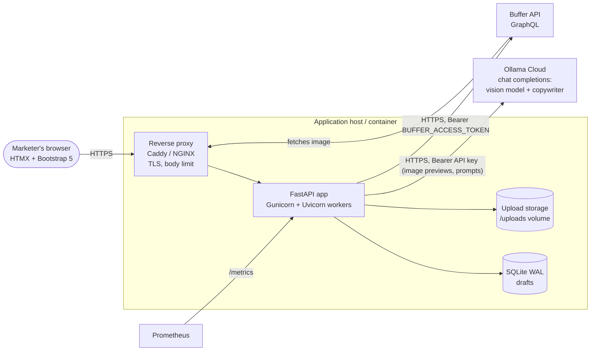
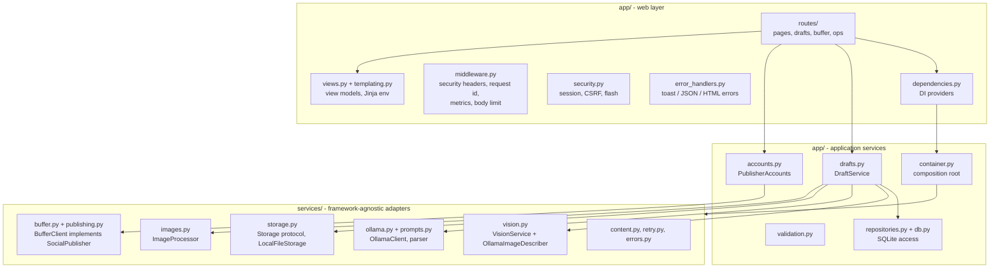
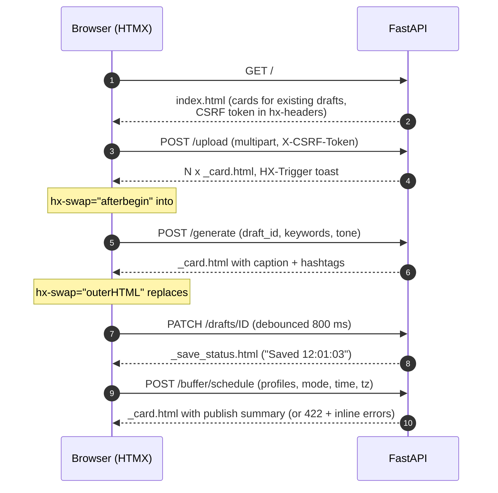
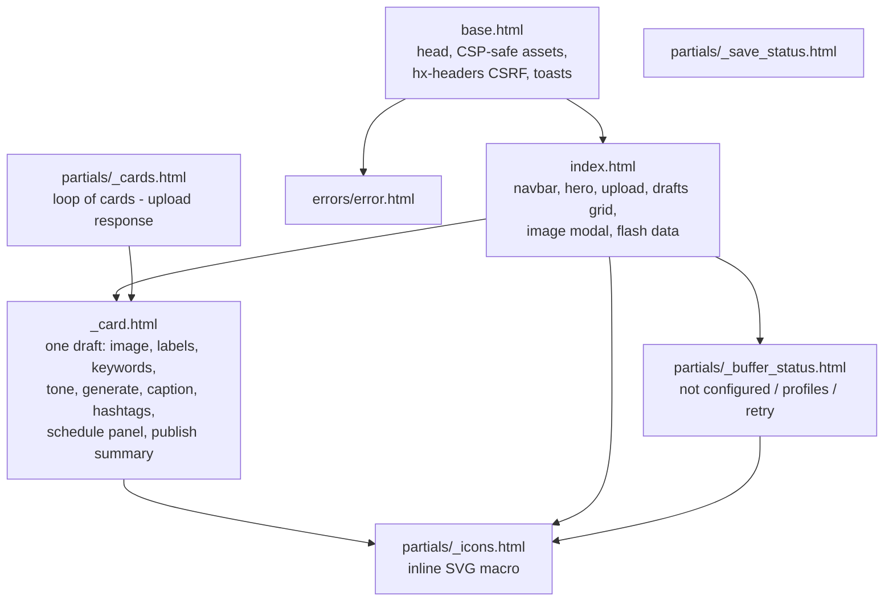
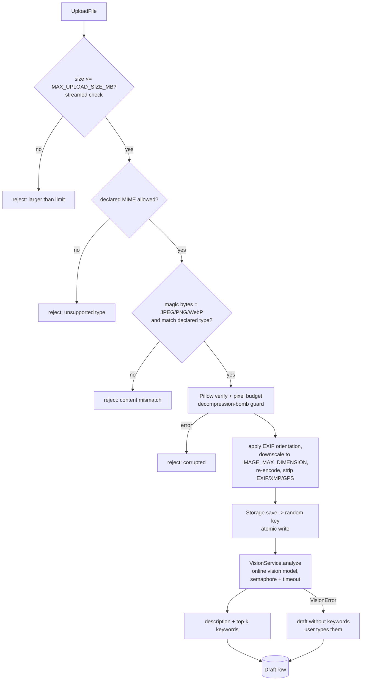
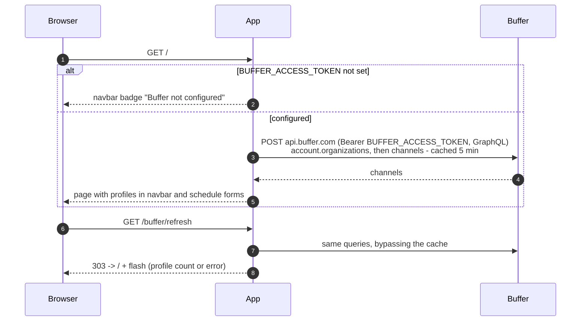
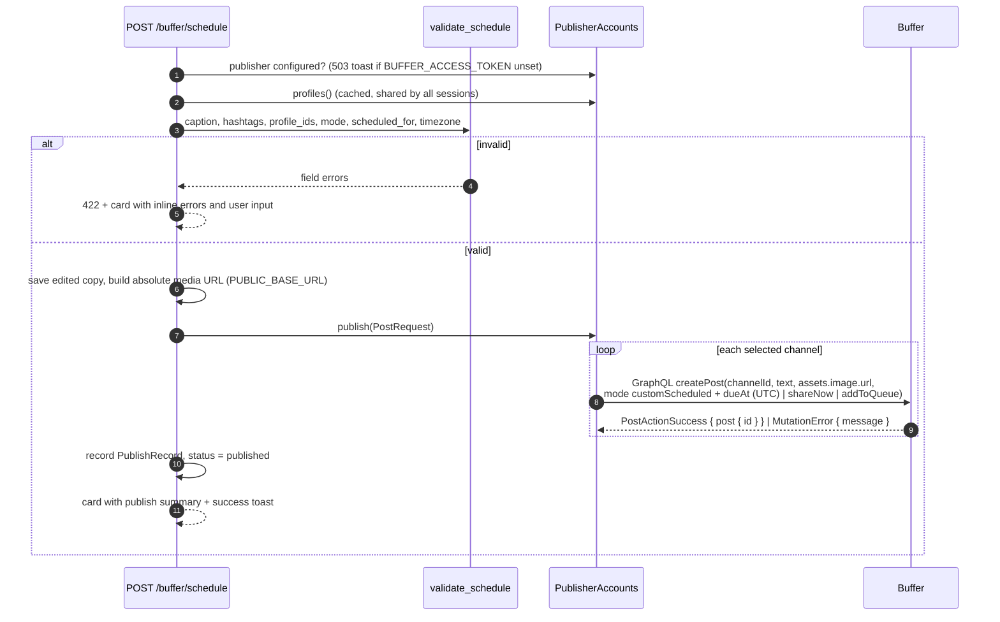
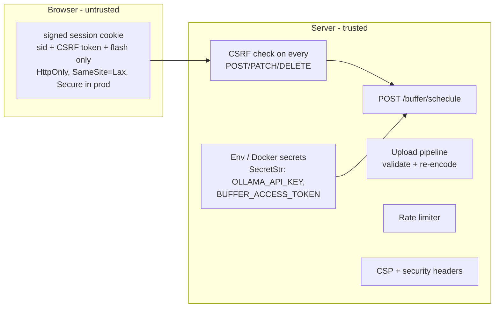

# Architecture

Social Booster is a single FastAPI service that renders HTML with
Jinja2 and uses HTMX for in-page updates. There is no separate front-end build:
the browser loads one page, and every interaction (upload, AI generation,
autosave, scheduling) is a small HTTP request that returns an HTML fragment.

## 1. System context



Secrets (Ollama key, Buffer personal API key) only ever exist on the server.
The browser holds a signed session cookie containing a random session id and a
CSRF token - nothing else. The Buffer key is server configuration, so every
visitor of the app posts to the same Buffer account; the app has no login of
its own (see [SECURITY.md](SECURITY.md)).

## 2. Code layout and layers



Dependency rule: `services/` never imports `app/`. Services receive plain
dataclass configs (`VisionConfig`, `OllamaConfig`, `BufferConfig`) and a shared
`httpx.AsyncClient`, so they can be reused from a CLI or worker and are unit
tested without FastAPI.

| Layer | Responsibility | Key types |
|---|---|---|
| Routes | Parse forms, call application services, pick a template | `APIRouter`s in `app/routes/` |
| Dependencies | Inject container, session id, CSRF check, rate limits, "publisher configured" guard | `app/dependencies.py`, `app/rate_limit.py` |
| Application services | Orchestrate the workflow, enforce business rules | `DraftService`, `PublisherAccounts` |
| Repositories | Persistence scoped by session id | `DraftRepository` |
| Service adapters | Talk to Ollama (vision + copy), Buffer, disk | `VisionService`, `OllamaClient`, `BufferClient`, `LocalFileStorage` |
| Composition root | Build everything from `Settings`, own lifecycle | `ServiceContainer`, `create_app()` |

## 3. Request pipeline

```mermaid
flowchart LR
    req[HTTP request] --> sh[SecurityHeaders]
    sh --> rc[RequestContext<br/>X-Request-ID, access log,<br/>metrics, 500 page]
    rc --> bl[BodySizeLimit<br/>413]
    bl --> th[TrustedHost<br/>optional]
    th --> sess[SessionMiddleware<br/>signed cookie]
    sess --> router[FastAPI router]
    router --> d1[Depends: rate_limit]
    d1 --> d2[Depends: verify_csrf]
    d2 --> d3[Depends: session id /<br/>publisher configured]
    d3 --> handler[Route handler]
    handler --> tpl[TemplateResponse<br/>+ HX-Trigger toast]
```



Exceptions are mapped centrally (`app/error_handlers.py`): HTMX requests get
an empty body with an `HX-Trigger` toast and `HX-Reswap: none` (the page keeps
its state), JSON clients get `{"detail", "request_id"}`, and browsers get the
`errors/error.html` page.

## 4. HTMX interaction model



HTMX runtime configuration (rendered into `<meta name="htmx-config">`):

* `allowEval: false`, `allowScriptTags: false`, `includeIndicatorStyles: false`
  so the strict CSP (`script-src 'self'; style-src 'self'`) holds.
* `responseHandling` swaps **422** responses, so validation errors re-render
  the card inline; other 4xx/5xx are never swapped and surface as toasts.
* `selfRequestsOnly: true` - HTMX can only talk to this origin.

`static/js/app.js` adds only UI glue: toasts from `HX-Trigger`, drag & drop,
client-side pre-validation and previews (object URLs), upload progress,
character/hashtag counters, browser-timezone detection, local time display,
the image modal and the light/dark theme toggle.

## 5. Template architecture



Fragments are rendered with `TemplateResponse` so a single context processor
(`app/templating.py`) supplies `csrf_token`, `static_url()`, `app_name` and the
HTMX config everywhere. `_card.html` is driven by a `CardView` view model
(`app/views.py`) whose form values fall back to the stored draft but are
overridden by submitted values after a validation error - nothing the user
typed is lost.

## 6. Image processing flow



Decoded images cost ~4 bytes per pixel, so each worker decodes at most
`IMAGE_MAX_CONCURRENCY` (default 1) images at a time across all requests; the
rest of a batch waits in the multipart spool files on disk. Images whose longer
side exceeds `IMAGE_MAX_DIMENSION` (default 2048 px) are downscaled before
storing; JPEGs are decoded straight at 1/2, 1/4 or 1/8 scale by libjpeg
(`Image.draft`), so a large photo never exists in memory at full size. EXIF
orientation is applied in place, and the vision backend gets a <=512 px
preview made while the pixels are decoded instead of decoding the stored file
again.

The preview is sent as a base64 JPEG to a vision model (`VISION_MODEL`,
default `gemma4:31b`, free on Ollama Cloud) through the same `OllamaClient` as
copywriting, sharing `OLLAMA_ENDPOINT`/`OLLAMA_API_KEY` unless
`VISION_ENDPOINT`/`VISION_API_KEY` are set. It returns JSON with a one-sentence
`description` and `keywords`. The description is shown on the card, used as alt
text and passed to the caption prompt as background. Nothing heavy runs in the
worker (~50 MB RSS). `VISION_BACKEND=disabled` skips the call and users type
the keywords.

A semaphore (`VISION_MAX_CONCURRENCY`) bounds analyses per worker and
`VISION_TIMEOUT_SECONDS` caps each one; failures leave the draft without
keywords and the user types them. Pillow work runs through `asyncio.to_thread`.

## 7. AI generation flow

```mermaid
sequenceDiagram
    autonumber
    participant R as POST /generate
    participant D as DraftService
    participant O as OllamaClient
    participant C as Ollama Cloud
    R->>D: generate(session, draft_id, keywords, tone)
    D->>D: normalize_keywords (empty -> 422 inline error)
    D->>O: generate_copy(CopyRequest)
    O->>O: build_copy_messages (system + JSON-only user prompt)
    loop retry policy (timeouts, 429, 5xx; honours Retry-After)
        O->>C: POST /v1/chat/completions (Bearer key)
        C-->>O: choices[0].message.content
    end
    O->>O: parse_copy: JSON -> "CAPTION:/HASHTAGS:" -> heuristic
    alt unparseable
        O->>C: repair turn ("reply with ONLY the JSON object")
        C-->>O: corrected answer
    end
    O->>O: finalize: caption <= CAPTION_MAX_CHARS,<br/>HASHTAGS_MIN..MAX (top up from keywords)
    O-->>D: GeneratedCopy
    D->>D: save draft (status = generated)
    D-->>R: Draft -> _card.html
```

Failure handling: 401/403 -> "check OLLAMA_API_KEY" (no retry); 404 -> model
not found; exhausted retries -> 503 "AI service busy"; reasoning models that
spend all tokens -> explicit "increase OLLAMA_MAX_TOKENS". The card is never
replaced on failure (`HX-Reswap: none`), so edits are preserved.

## 8. Buffer authentication and profiles

The app authenticates to Buffer with one personal API key created in Buffer
(*Settings -> API -> Create API key*) and configured as `BUFFER_ACCESS_TOKEN`.
The key acts on behalf of that one Buffer account, reaches all of its
organizations and channels, has no scopes and does not expire until it is
revoked - so there is no consent screen, code exchange or token refresh.



`PublisherAccounts` (`app/accounts.py`) wraps the `SocialPublisher`
implementation (`BufferClient`) and keeps a single, server-wide profile cache
(`BUFFER_PROFILES_CACHE_SECONDS`); every session sees the same account and
profiles. Its `status()` never raises: it reports *not configured*,
*connected* (with profiles, or with an outage message) or *rejected*.

If Buffer rejects the key (HTTP 401/403 or a GraphQL `UNAUTHORIZED` /
`UNAUTHENTICATED` error) the cache is dropped and the UI shows "Buffer rejected
the configured access token. Check BUFFER_ACCESS_TOKEN (Buffer -> Settings ->
API)." with a "Buffer unavailable · Retry" button (navbar) and a "Retry Buffer"
button (schedule panel), both linking to `/buffer/refresh`. Nothing is deleted;
the error persists until the key is fixed on the server.

## 9. Scheduling flow



Only connection failures that happened *before* the request was sent are
retried when posting, so a retry can never create a duplicate post. Channels
are independent: if Buffer refuses some of them, the others are still sent and
the toast names the refused ones; only when every channel fails is it an error.
A rejected key aborts the request with a `502` toast and clears the profile
cache.

## 10. Security model



The app has no user accounts: anyone who can reach it can publish with the
configured Buffer key, so public deployments belong behind access control at
the proxy (basic auth, SSO, IP allow-list).

See [SECURITY.md](SECURITY.md) for the full threat model and controls.

## 11. Persistence

| Table | Key | Content |
|---|---|---|
| `drafts` | `id`, indexed by `(session_id, created_at)` | Draft JSON document (labels, keywords, caption, hashtags, publish record) |

A background task (hourly) deletes drafts untouched for
`DRAFT_RETENTION_HOURS` together with their images. The `oauth_tokens` table
used by older versions (per-session Buffer OAuth tokens) is dropped on startup
so their refresh tokens do not linger.

## 12. Extensibility

| Extension | How |
|---|---|
| Another vision model or provider | Set `VISION_MODEL` / `VISION_ENDPOINT` / `VISION_API_KEY` (any OpenAI-compatible endpoint that accepts images), or implement the `ImageDescriber` protocol and pass it to `VisionService` |
| Another LLM provider (OpenAI, Gemini, self-hosted Ollama) | Point `OLLAMA_ENDPOINT` at any OpenAI-compatible endpoint, or Ollama's native `/api/chat` |
| Another publishing provider | Implement `SocialPublisher` (`services/publishing.py`) and wire it in `app/container.py` |
| Object storage (S3, GCS) | Implement the `Storage` protocol; return public URLs from `public_path()` |
| Multi-host deployment | Swap SQLite for Postgres in the repositories and the in-process rate limiter for Redis; the interfaces stay the same |

## 13. Key design decisions

1. **Server-side drafts.** Uploaded images and generated copy are persisted per
   session, so a reload or a Buffer outage never loses work and
   every request references a `draft_id` instead of trusting client-supplied
   image URLs or labels.
2. **One server-wide Buffer key.** The original design kept a per-visitor Buffer
   token in a signed cookie (signed is not encrypted); a later version used
   per-session OAuth tokens encrypted at rest. Buffer now authenticates with a
   single personal API key held in server configuration, so no Buffer
   credential is ever stored per session or sent to the browser, and the cookie
   carries only an opaque session id. The trade-off: every visitor shares that
   Buffer account, so access to the app must be controlled in front of it.
3. **Vendored front-end assets.** Bootstrap and HTMX are served from `/static`
   so the CSP can forbid every third-party script and the app works offline.
4. **Graceful degradation.** Vision failures fall back to manual keywords, Buffer
   outages are reported in the UI, AI errors keep the card intact.
5. **No eval anywhere.** HTMX eval is disabled; all behaviour is declarative
   attributes plus one small static script.
